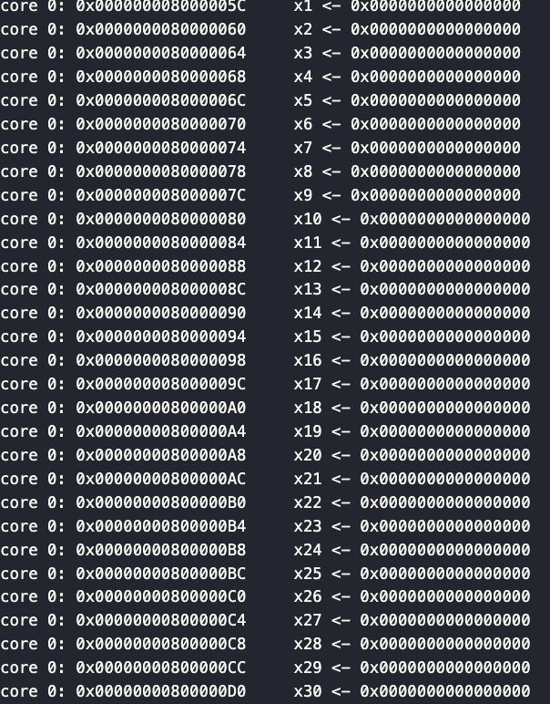

# Lab1 report

## Spike model and co-sim

### Spike model (with risc-v pk) execution correctness


### GreenRio core RTL execution correctness
The verification environment is located at **./verilog/dv**.
1. Convert the orignal elf file into hex file to facilitate magic memory to read it.
2. Instanse GreenRio(hehe.v) and magic memory(dpram64.v) in hehe_tb.sv, connecting them and giving rst and clk signal to motivate them.
3. Use HTIF (read the .tohost section physical address) to detect whether the program executes successfully.


### Spike model + GreenRio RTL co-simulation system
1. Use spike to print the log

2. Use DPI to embed probe into simulating circuit and print executing log, which is stored in **./verilog/dv/greenrio_log.txt**.
> First, I maintain a virtual physical register heap in C++ synchronous with circuit, when detecting input to physical resgister, it catch up the signal and change value synchronously. <br>Second, when DPI probe in RCU detects that one instruction is committing, read the rename table to get the corresponding physical register name. Then read the value from virtual physical register, and print this assignment result in the log with PC.
>
>


## Open EDA flow
1. SKY130A synthesis<br>
    **./backend_log/RUN_1** records the GreenRio synthesis flow.
    the corner constraints are as follows:
    ```
    set ::env(LIB_SYNTH) "$::env(PDK_ROOT)/$::env(PDK)/libs.ref/$::env(STD_CELL_LIBRARY)/lib/sky130_fd_sc_hd__tt_025C_1v80.lib"
    set ::env(LIB_FASTEST) "$::env(PDK_ROOT)/$::env(PDK)/libs.ref/$::env(STD_CELL_LIBRARY)/lib/sky130_fd_sc_hd__ff_n40C_1v95.lib"
    set ::env(LIB_SLOWEST) "$::env(PDK_ROOT)/$::env(PDK)/libs.ref/$::env(STD_CELL_LIBRARY)/lib/sky130_fd_sc_hd__ss_100C_1v60.lib"
    ``` 
    **./backend_log/RUN_2** records the GreenRio synthesis flow.
    the corner constraints are as follows: 
    ```
    set ::env(LIB_SYNTH) "$::env(PDK_ROOT)/$::env(PDK)/libs.ref/$::env(STD_CELL_LIBRARY)/lib/ssky130_fd_sc_hd__ff_100C_1v65.lib"
    set ::env(LIB_FASTEST) "$::env(PDK_ROOT)/$::env(PDK)/libs.ref/$::env(STD_CELL_LIBRARY)/lib/sky130_fd_sc_hd__ff_n40C_1v95.lib"
    set ::env(LIB_SLOWEST) "$::env(PDK_ROOT)/$::env(PDK)/libs.ref/$::env(STD_CELL_LIBRARY)/lib/sky130_fd_sc_hd__ss_100C_1v60.lib"
    ``` 