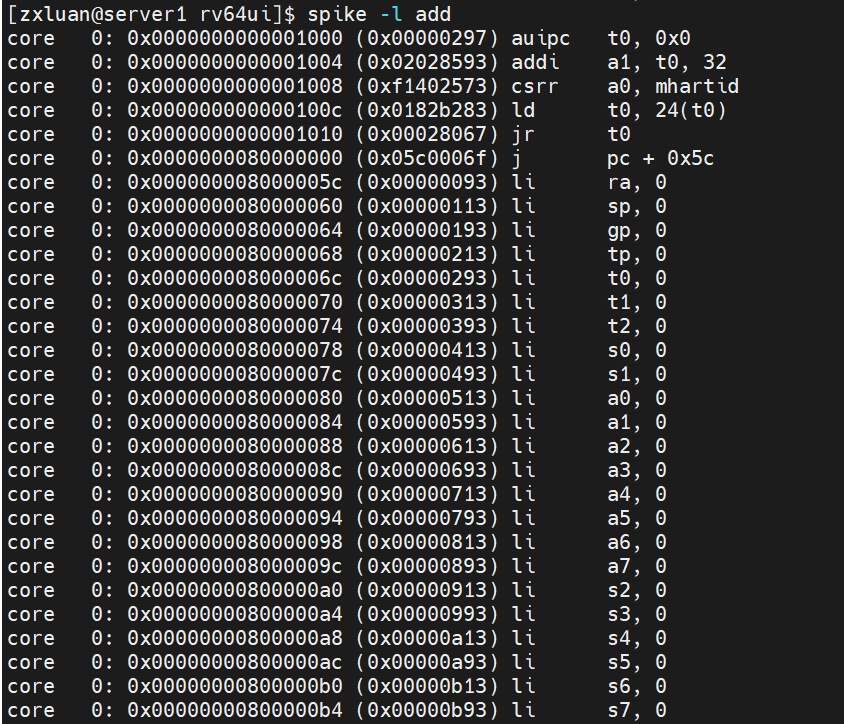

# Lab1 report

## Spike model and co-sim

### Spike model (with risc-v pk) execution correctness

### GreenRio core RTL execution correctness
The verification environment is located at **./verilog/dv**.
1. Convert the orignal elf file into hex file to facilitate magic memory to read it.
2. Instanse GreenRIos and magic memory in hehe_tb.sv, connecting them and giving rst and clk signal to motivate them.
3. Use HTIF to detect whether the program executes successfully.

### Spike model + GreenRio RTL co-simulation system
1. Use spike to print the log

2. Use DPI to embed probe into core and print executing log

3. 